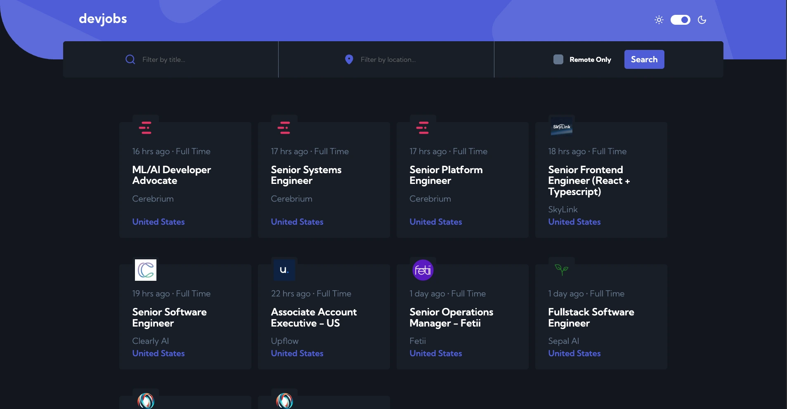

# Frontend Mentor - Devjobs Web App Solution

This is my solution to the [Devjobs web app challenge on Frontend Mentor](https://www.frontendmentor.io/challenges/devjobs-web-app-HuvC_LP4l). Frontend Mentor challenges help improve coding skills through building realistic projects.

## Table of Contents

- [Overview](#overview)
  - [The Challenge](#the-challenge)
  - [Screenshot](#screenshot)
  - [Links](#links)
- [My Process](#my-process)
  - [Built With](#built-with)
  - [What I Focused On](#what-i-focused-on)
  - [Continued Development](#continued-development)
  - [Useful Resources](#useful-resources)
- [Author](#author)
- [Acknowledgments](#acknowledgments)

## Overview

### The Challenge

Users should be able to:

- View the optimal layout for each page depending on their device's screen size
- See hover states for all interactive elements throughout the site
- Filter jobs on the index page by title, location, and whether a job is for a full-time position
- Click a job from the index page to read more information and apply for the job
- **Bonus**: Experience the correct color scheme based on their computer preferences using `prefers-color-scheme` in CSS

### Screenshot

### Links

- [Solution URL](https://github.com/cepoumian/devjobs)
- [Live Site URL](https://cepo-devjobs.netlify.app/)

## My Process

### Built With

- [React](https://reactjs.org/) - JS library
- [Vite](https://vitejs.dev/) - Build tool and development server
- [React Query](https://tanstack.com/query/latest) - Data fetching and state management
- [TanStack Router](https://tanstack.com/router/latest) - Type-safe routing
- [Sass](https://sass-lang.com/) - CSS preprocessor
- Flexbox and CSS Grid
- Mobile-first workflow

### What I Focused On

This project provided valuable experience with implementing:

- Efficient data fetching and cache management with React Query
- Type-safe routing with TanStack Router
- Comprehensive test coverage with Vitest and React Testing Library
- State management for job listings and filter states
- Advanced filtering functionality with multiple parameters
- Organizing styles with Sass modules and variables
- Dark/light mode toggling with `prefers-color-scheme` and user preferences
- Responsive design techniques for various screen sizes

### Continued Development

In future projects, I plan to focus on:

- Implementing more advanced React Query patterns
- Exploring server-state synchronization techniques
- Further developing type-safe routing with TanStack Router
- Enhancing accessibility features
- Improving performance optimization techniques

### Useful Resources

- [React Query Documentation](https://tanstack.com/query/latest/docs/react/overview) - Excellent resource for mastering data fetching and state management
- [TanStack Router Documentation](https://tanstack.com/router/latest/docs/framework/react/overview) - Comprehensive guide for type-safe routing
- [Sass Documentation](https://sass-lang.com/documentation/) - Detailed reference for Sass features and techniques
- [Vite Documentation](https://vitejs.dev/guide/) - Guide for optimizing the development workflow
- [CSS-Tricks Flexbox Guide](https://css-tricks.com/snippets/css/a-guide-to-flexbox/) - Helpful visual guide for Flexbox
- [CSS-Tricks Grid Guide](https://css-tricks.com/snippets/css/complete-guide-grid/) - Comprehensive CSS Grid reference
